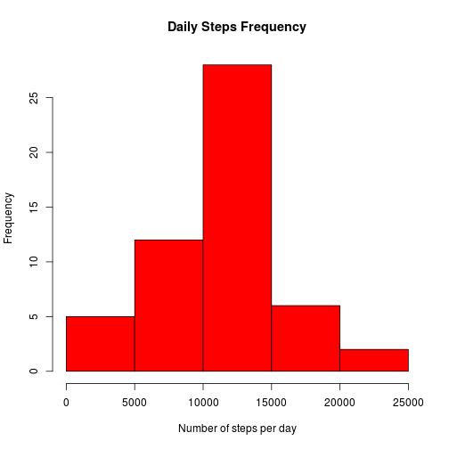
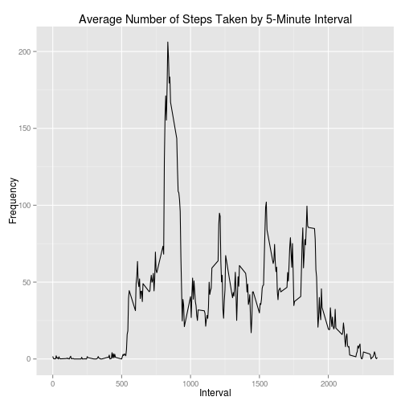
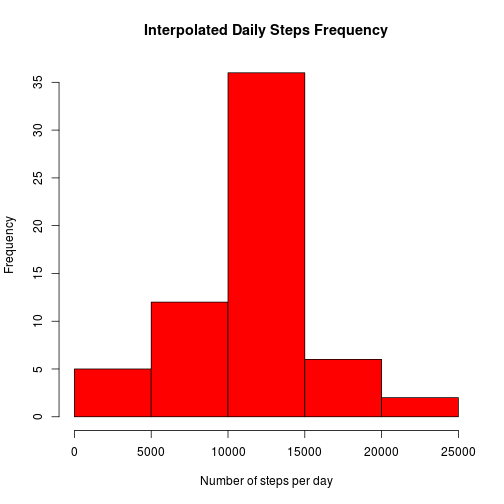
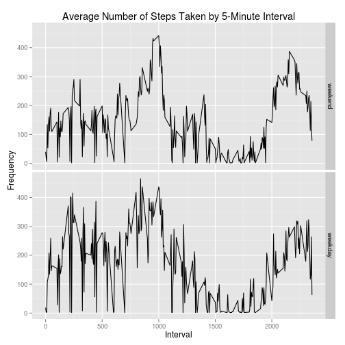

Reproducible Research - Peer Assignment # 1
========================================================

<h2>Loading and preprocessing the data</h2>

* Load activity data


```r
# Read the data
Sys.setlocale("LC_TIME","C")
```

```
## [1] "C"
```

```r
temp <- tempfile()
download.file("http://d396qusza40orc.cloudfront.net/repdata%2Fdata%2Factivity.zip", temp)
rawdata <- read.csv(unz(temp, "activity.csv"), header=TRUE, colClasses=c("numeric", "character", "numeric"))
```

* Removing the unknown data for the first part of the assignment


```r
# Removing unknown data
rawdataNoNas <- na.omit(rawdata)
rawdataNoNas <- rawdataNoNas[,1:3]
```

<h2>Finding the mean total number of steps taken per day</h2>
* Calculating the daily steps frequency

```r
# Daily Steps Frequency
dailySteps <- as.numeric(unlist(aggregate(as.numeric(rawdataNoNas$steps), by=list(rawdataNoNas$date), FUN=sum)[2]))
hist(dailySteps, xlab="Number of steps per day", col="red", main="Daily Steps Frequency")
```

 

```r
mean(dailySteps)
```

```
## [1] 10766
```

```r
median(dailySteps)
```

```
## [1] 10765
```

* Conclusion: the mean number of steps taken per day is 10766, and the median number of steps taken each day is 10765.

<h2>Finding the average daily activity pattern </h2>
* Make a time series plot (i.e. type = “l”) of the 5-minute interval (x-axis) and the average number of steps taken, averaged across all days (y-axis)

```r
# Average 5-minutes Steps
fiveMinutesSteps <- aggregate(as.numeric(rawdataNoNas$steps), by=list(rawdataNoNas$interval), FUN=mean)
library(ggplot2)
ggplot(data=fiveMinutesSteps, aes(x=Group.1, y=x, group=1)) + geom_line() + labs(title = "Average Number of Steps Taken by 5-Minute Interval", x="Interval", y="Frequency")
```

 
* Finding which 5-minute interval, on average across all the days in the dataset, contains the maximum number of steps

```r
which.max(fiveMinutesSteps[,2])
```

```
## [1] 104
```

```r
max(fiveMinutesSteps[,2])
```

```
## [1] 206.2
```
* Conclusion: Interval  contains the maximum number of steps on average of .

<h2>Imputing missing values</h2>
* Calculate the number of missing values

```r
# Calculate the number of missing values
numMissingValues <- sum(is.na(rawdata$steps))
```

* Devise a strategy for filling in all of the missing values in the dataset. The strategy does not need to be sophisticated. For example, you could use the mean/median for that day, or the mean for that 5-minute interval, etc.  We shall replace missing step values with the mean for a given 5-minute interval across the entire observation period


```r
interpolatedData <- t(apply(rawdata, 1, function(x) {if(is.na(x[1])) { y <- match(as.numeric(x[3]), fiveMinutesSteps[,1]); x[1] <- fiveMinutesSteps[y,2]}; return(x)}))
```

* Create a new dataset that is equal to the original dataset but with the missing data filled in


```r
# Make an histogram with the interpolated values
interpolatedDailySteps <- as.numeric(unlist(aggregate(as.numeric(interpolatedData[,1]), by=list(interpolatedData[,2]), FUN=sum)[2]))
```

* Make a histogram of the total number of steps taken each day and Calculate and report the mean and median total number of steps taken per day. Do these values differ from the estimates from the first part of the assignment? What is the impact of imputing missing data on the estimates of the total daily number of steps?


```r
hist(interpolatedDailySteps, xlab="Number of steps per day", col="red", main="Interpolated Daily Steps Frequency")
```

 

```r
mean(interpolatedDailySteps)
```

```
## [1] 10766
```

```r
median(interpolatedDailySteps)
```

```
## [1] 10766
```

<h2>Finding differences in activity patterns between weekdays and weekends</h2>
* For this part the weekdays() function may be of some help here. Use the dataset with the filled-in missing values for this part. Create a new factor variable in the dataset with two levels – “weekday” and “weekend” indicating whether a given date is a weekday or weekend day.


```r
# Plot separately the average daily steps for weekdays and weekends
factoredData <- data.frame(cbind(interpolatedData, dayType=factor(weekdays(as.Date(interpolatedData[,2]))%in% c("Saturday", "Sunday"), labels=c("weekday","weekend"))))
factoredData$steps <- as.numeric(factoredData$steps)
```

* Make a panel plot containing a time series plot (i.e. type = “l”) of the 5-minute interval (x-axis) and the average number of steps taken, averaged across all weekday days or weekend days (y-axis). The plot should look something like the following, which was creating using simulated data


```r
averagedSteps <- data.frame(xtabs(steps ~ interval + dayType, aggregate(steps ~ interval + dayType, factoredData, mean)))
averagedSteps$interval <- fiveMinutesSteps[,1]
averagedSteps <- averagedSteps[with(averagedSteps, order(interval)),]
levels(averagedSteps$dayType) <- c("weekend", "weekday")
ggplot(aes(x=interval, y=Freq), data = averagedSteps) + facet_grid(dayType ~ ., labeller = label_value) + geom_line() + labs(title = "Average Number of Steps Taken by 5-Minute Interval", x="Interval", y="Frequency")
```

 
